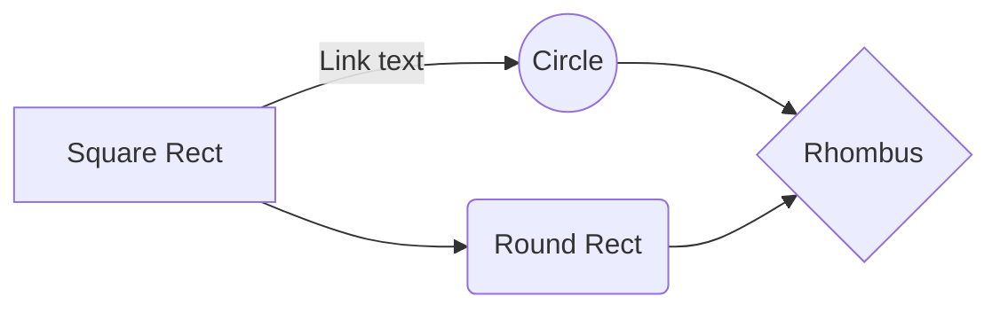

# Expand problem

## Markdown vs. shortcodes

### Expand with markdown

{}

Some normal text...

- Some markdown
- with **bold** and _italic_ text

{}Some Button{}

{}

### Expand with shortcodes



Some normal text...

- Some markdown
- with **bold** and _italic_ text

{}Some Button{}



### Expand with markdown & shortcodes



Some normal text...


- Some markdown
- with **bold** and _italic_ text


{}Some Button{}



## Markdown vs. Mermaid

### Mermaid only


graph LR
    A[Square Rect] -- Link text --> B((Circle))
    A --> C(Round Rect)
    B --> D{Rhombus}
    C --> D


### Expand with mermaid shortcode




graph LR
    A[Square Rect] -- Link text --> B((Circle))
    A --> C(Round Rect)
    B --> D{Rhombus}
    C --> D




### Expand with mermaid code fences

{}

{}
